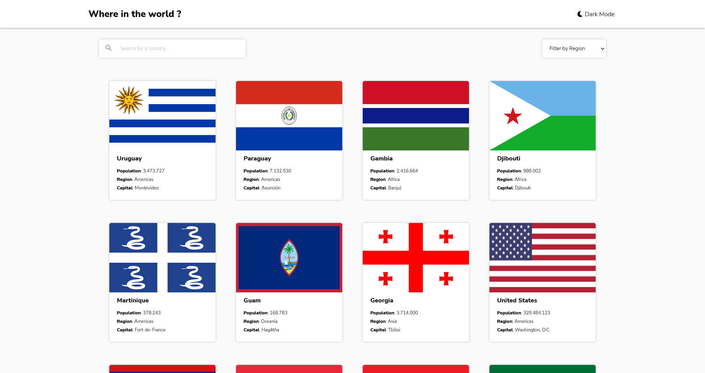
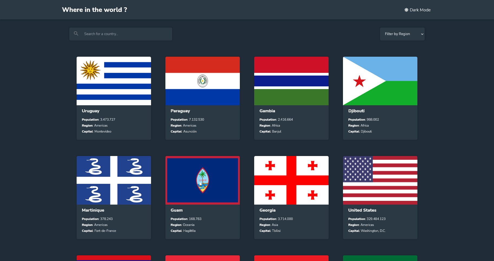
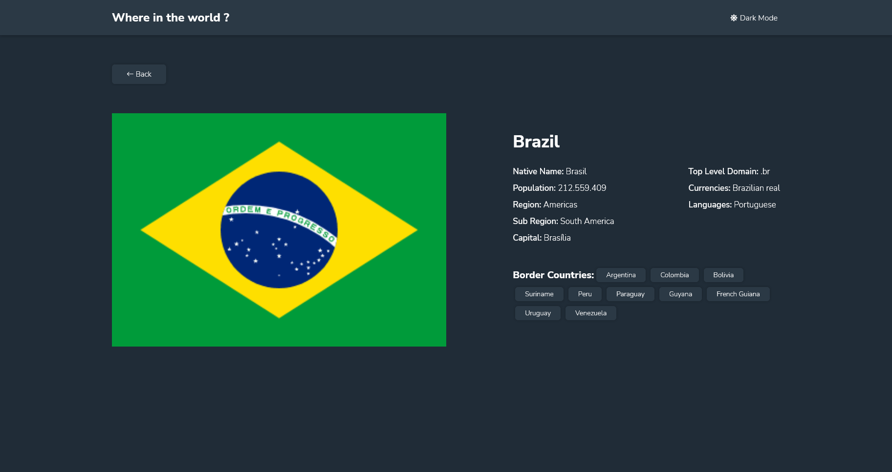
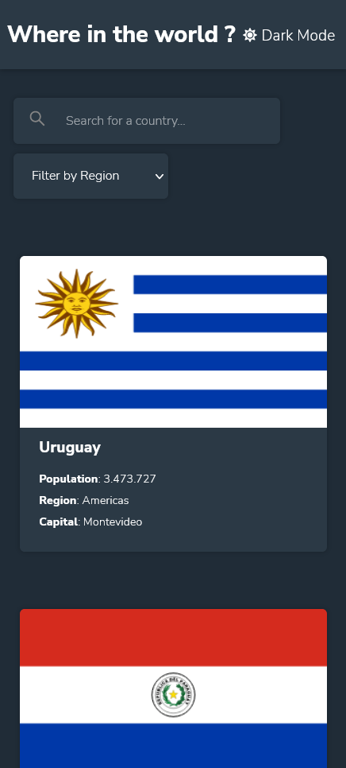
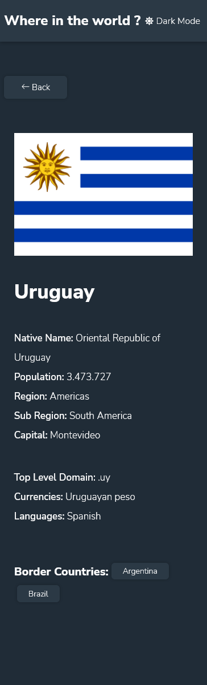
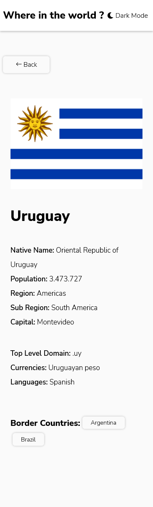

# Frontend Mentor - REST Countries API with color theme switcher solution

This is a solution to the [REST Countries API with color theme switcher challenge on Frontend Mentor](https://www.frontendmentor.io/challenges/rest-countries-api-with-color-theme-switcher-5cacc469fec04111f7b848ca).

## Table of contents

-   [Overview](#overview)
    -   [The challenge](#the-challenge)
    -   [Screenshot](#screenshot)
    -   [Links](#links)
-   [My process](#my-process)
    -   [Built with](#built-with)
-   [Author](#author)

## Overview

### The challenge

Users should be able to:

-   See all countries from the API on the homepage
-   Search for a country using an `input` field
-   Filter countries by region
-   Click on a country to see more detailed information on a separate page
-   Click through to the border countries on the detail page
-   Toggle the color scheme between light and dark mode _(optional)_

### Screenshot

### Links

-   Solution URL: [Github](https://github.com/Flaviogameover/countries_api)
-   Live Site URL: [Heroku](https://flaviogameover-countries-api.netlify.app)

## My process

### Built with

-   Semantic HTML5 markup
-   CSS custom properties
-   Flexbox
-   JavaScript
-   React Router
-   React Icons
-   [RestCountries](https://restcountries.com/) - API Rest Countries
-   [Axios](https://axios-http.com/) - JS library
-   [React](https://reactjs.org/) - JS library

## Author

-   Github - [Link](https://github.com/Flaviogameover)
-   Frontend Mentor - [@Flaviogameover](https://www.frontendmentor.io/profile/Flaviogameover)
